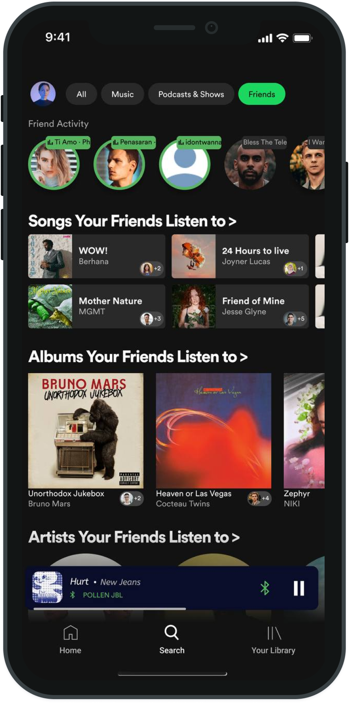
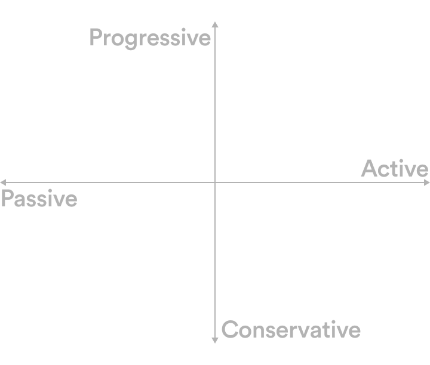
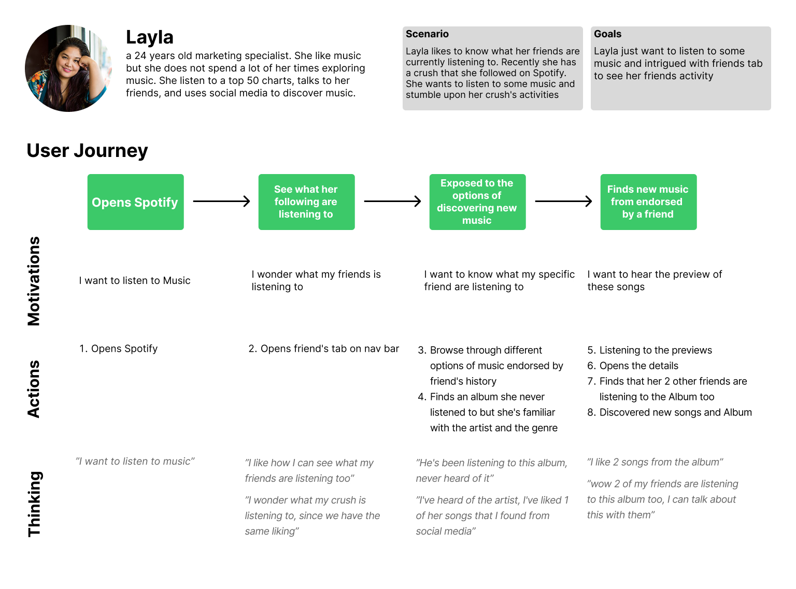
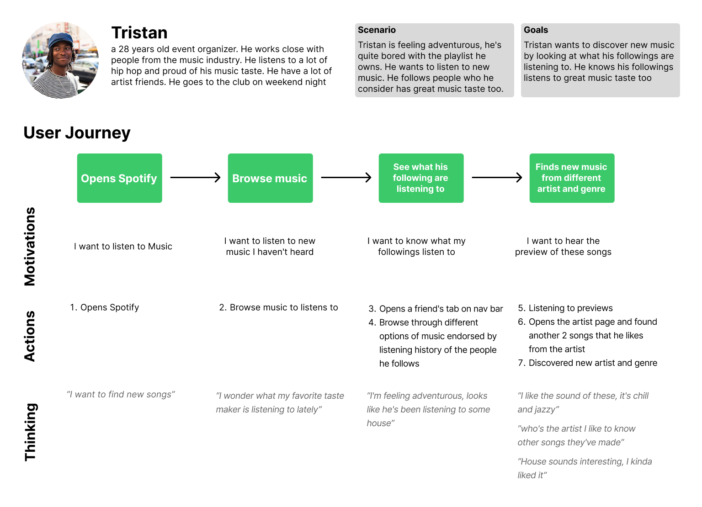
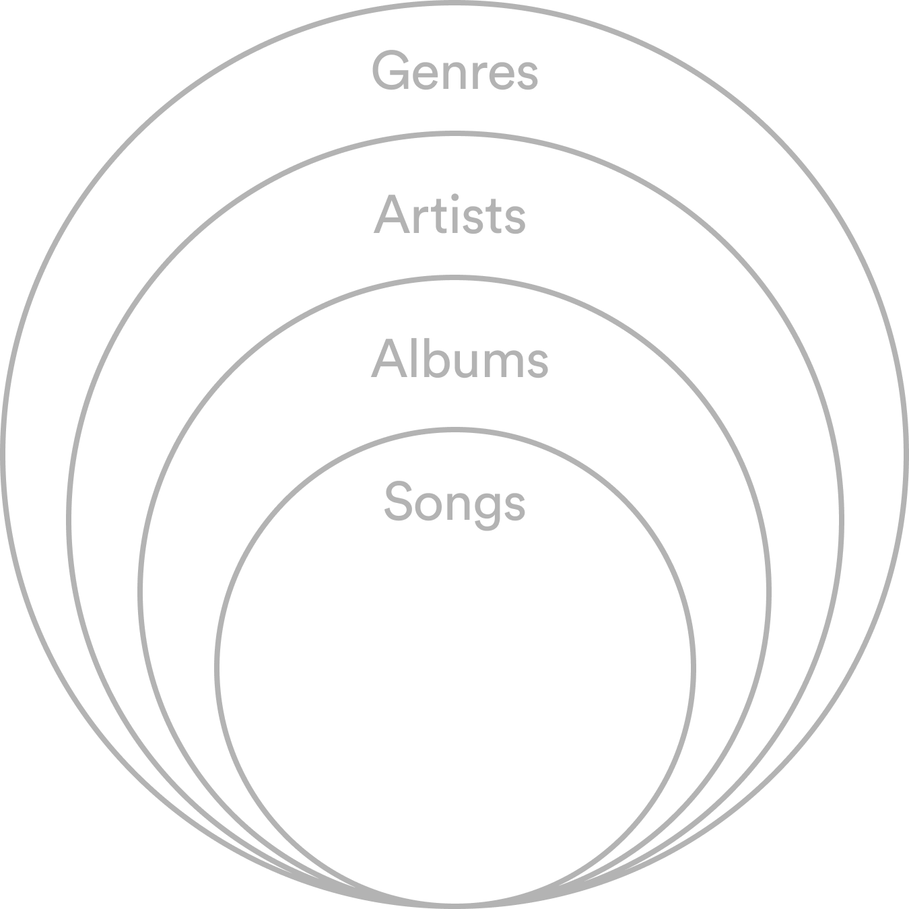
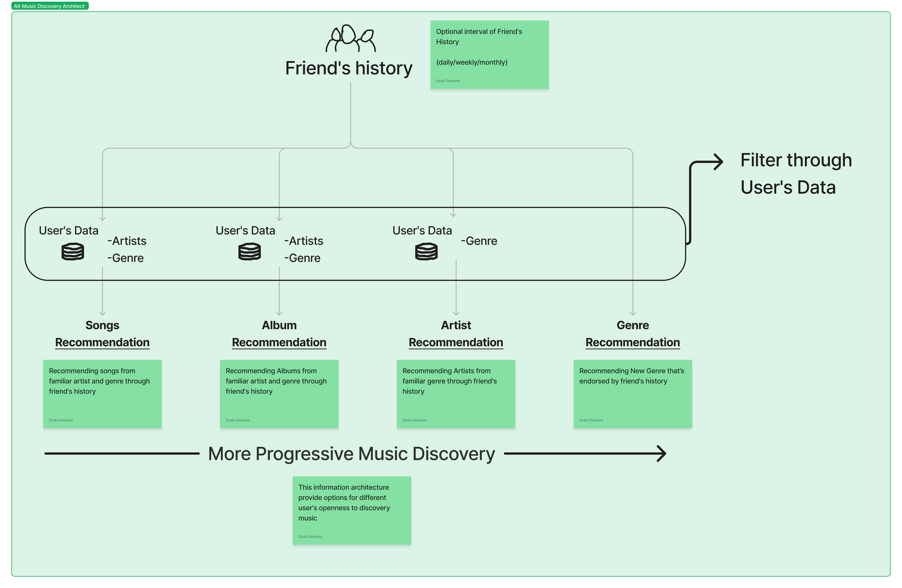
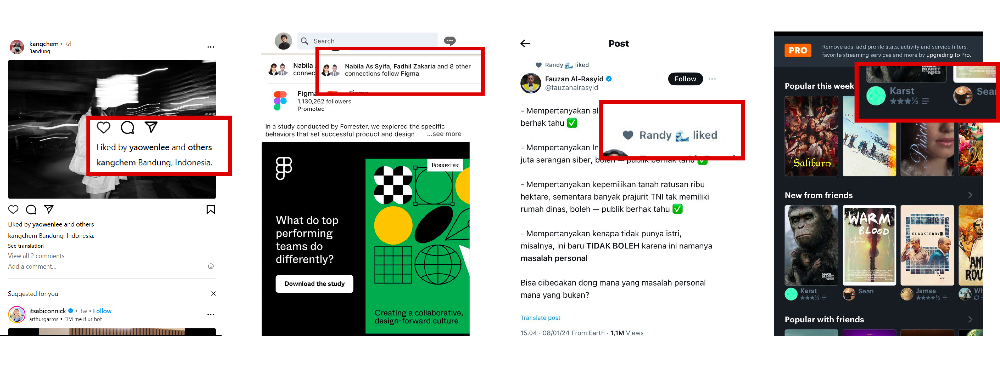
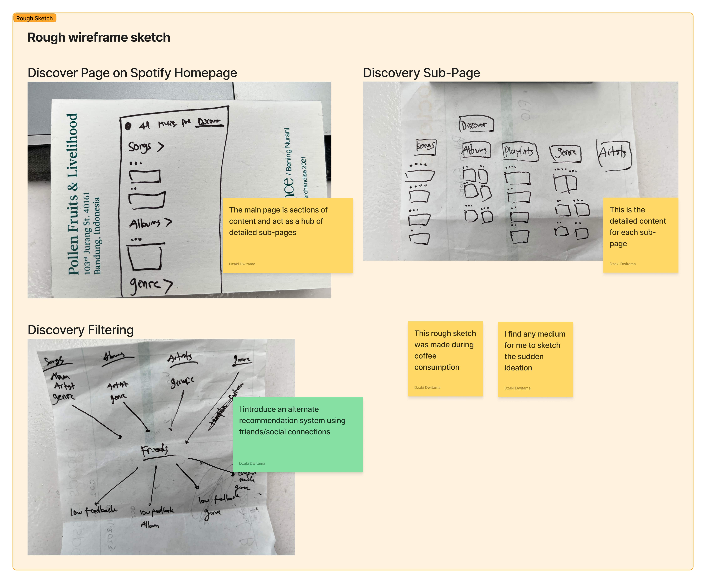
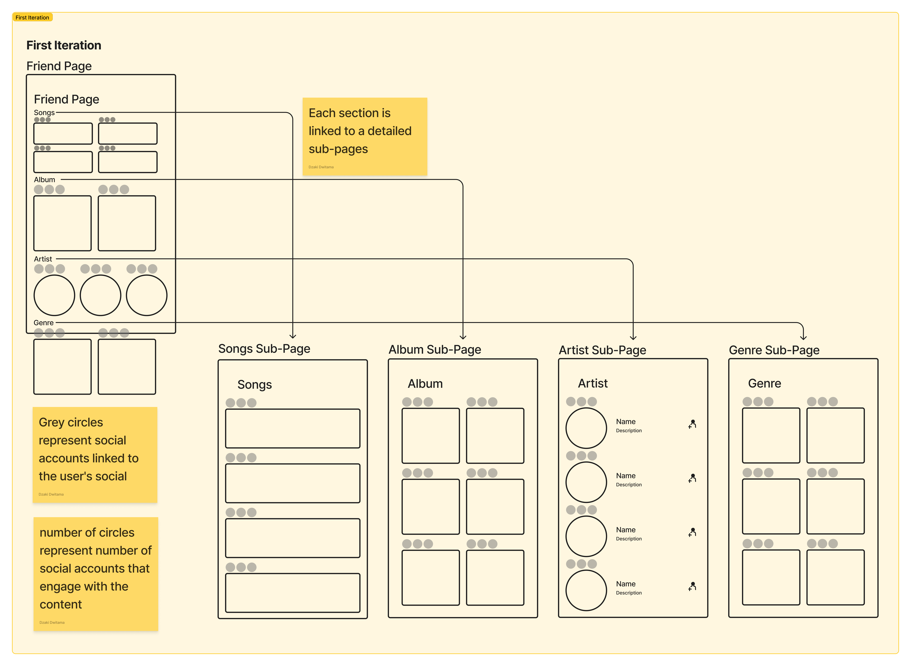

# Social Recommendation as Alternative for Music Discovery System on Spotify

Summary: Exploring alternatives for content distribution on Spotify
Time Frame: 2 weeks+
Role: Lead Researcher, Lead Designer
Tools: Notion, Figma, Figjam
Method: Case Study, Desk Research, Explorative Design, Wireframing

---

# Overview

---

<aside>
⚠️ **Problems**

Spotify uses multi-layered ML algorithm to recommend music to their users. But a lot of it’s **users are dissatisfied with the music that was recommended** to them. Most of them feels that it’s repetitive and boring.

Discovering new music could **help Spotify** **increase their user’s satisfaction and help content distribution.**

</aside>

<aside>
💡 **Solutions**

**Social Recommendation Feature**.

I incorporated social feature to the design that could help content recommendation and music discovery.

Spotify’s users will be able to discover new music through their peers.

</aside>

# Research

---

This project was initiated from my personal dissatisfaction towards Spotify’s recommendation. It started from curiosity to understand how did Spotify served me wrong. It started from a humble question to a fun project. The humble question changed to **3 research question.**

## Research TL;DR

<aside>
1️⃣ **How Spotify recommend their content?**

Spotify uses a complex and multi layered ML neural network called BaRT to understand both the content and the users through various data points.

</aside>

<aside>
2️⃣ **Has Spotify’s BaRT served it’s purposes?**

I searched for user’s feedback from multiple online community forum. BaRT is not a perfect solution for discovering and exploring new music.

</aside>

<aside>
3️⃣ **What are the alternatives that we can use?**

I proposed a Social Feature or Interaction as an alternative to Algorithm based recommendation.

</aside>

[**Read the detailed research report on my medium](https://medium.com/@dzakidwitama/spotify-but-make-it-social-a-uxr-speedruns-07900958a657)→**

## Understanding the users

### 1. Music Discovery Behavior

Discovering music is distributing content. But everyone differs in how they discover music.
I identify a spectrum in discovering music based on user’s intention and openness to experience.

<aside>
 **Passive**

**Little to no intention of discovering music**. Finds new music from BaRT algorithm, friends, or other media

</aside>

<aside>
 **Conservative**

**Low openness to experience.** Prefer to listen to music that has familiarity to current taste

</aside>

<aside>
 **Active**

**Low to high intention of discovering music**. Actively searching for new music from any source available

</aside>

<aside>
 **Progressive**

**High openness to experience**. Willing to listen to unfamiliar music

</aside>

### 2. User Persona

With these 2 different end of spectrum, I managed to developed personas for each ends.

# Problem & Design Goal

---

<aside>
⚠️ **Problem**

Spotify rely heavily to BaRT algorithm for distributing content and helping users discover new music that they’d like. But in reality there’s a lot of dissatisfaction on what BaRT has recommend to it’s users.

</aside>

<aside>
🎯 **Goal**

Create HI-FI design on social recommendation feature that’s **inclusive to different discovery behavior**

</aside>

## How might we create a social recommendation feature?

The proposed Social Feature **consists of 3 crucial features**

<aside>
 **Recommendation Hierarchy**

sub-pages based on hierarchy of content that is recommended to users

</aside>

<aside>
 **Social recommendation IA**

integrate an IA that uses current data points to show contents in social recommendation page

</aside>

<aside>
 **Dedicated Page for social recommendation**

a page dedicated to content that is endorsed by user’s friends

</aside>

# Design Choices

## 1. Recommendation Hierarchy

This hierarchy of sub-pages/section **provides option** for users to find best contents that suits their discovery behavior. To explain more about it take a look at the Social Recommendation IA.

## 2. Social Recommendation IA

I proposed to use friend’s history to provide endorsement of content. Filtered through user’s data to provide hierarchy to fit user’s discovery style.

## 3. Dedicated Page for Social Recommendation

### a. Social Proofing

Social proofing is a way to show a content is being endorsed by someone from the social circle. Social media has different ways to show social proofs

I decided to go with the same approach to **incite familiarity** with other social apps.

### b. Initial Sketch

This sketch **shows the main page** that contains sections of sub-page, **specific sub-pages**, and the **first sketch of the IA**

This is the first sketch I had in mind. I didn’t bring any devices on me while I was on a coffee shop. Thus I sketched it on a zine the coffee shop provided.

### c. Iteration I

The 1st iteration consists of Social Recommendation Page (**called Friend Page**). Inside this page are sections of hierarchy recommendation that aims to provide recommendation based on user’s music discovery behavior. Each page linked to a detailed page of recommended content.

I used profile picture to show endorsement by user’s socials.

### d. Iteration II

I ran a **workshop with 3 spotify users** to gain feedback from the 1st iteration.

<aside>
 It felt messy, too many faces of socials endorsement. Confusing.

</aside>

From the feedback, I tried to find other design choice to provide endorsement information.

I also add couple more change

<aside>
 **Endorsement Information**

I changed the endorsement information to be more simple

</aside>

<aside>
 **Friend’s Detail Overlay**

With simplifying the endorsement information I need other way to provide the rest of information

</aside>

<aside>

**Friends Activity**

I integrate the friends activity feature from the desktop version

</aside>

<aside>
 **Preview Overlay**

Following the Spotify latest update in UI, I implement the same UI as a preview

</aside>

# Final Design

Explore the prototype below

[https://www.figma.com/proto/AnDLbq2gk9LwcLv7oLeK7R/Spotify-Alt-MD?page-id=438%3A534&type=design&node-id=438-1699&viewport=702%2C382%2C0.22&t=7IpraoT9u9gbzUsQ-1&scaling=min-zoom&starting-point-node-id=438%3A1699&mode=design](https://www.figma.com/proto/AnDLbq2gk9LwcLv7oLeK7R/Spotify-Alt-MD?page-id=438%3A534&type=design&node-id=438-1699&viewport=702%2C382%2C0.22&t=7IpraoT9u9gbzUsQ-1&scaling=min-zoom&starting-point-node-id=438%3A1699&mode=design)
